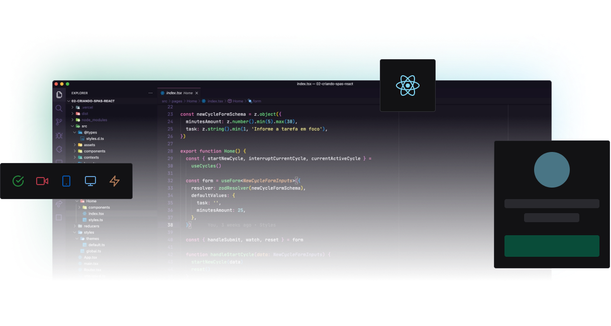

<div align="center">
  
</div>


<a id="sobre"></a>

## :book: Sobre

**Event Platform** é uma aplicação web que cadastra leads e apresenta uma visualização de evento atráves de vídeos e materiais complementares.

Esta aplicação foi construida no durante o **Ignite Labs** distribuida pela [Rocketseat](https://rocketseat.com.br/).


<a id="tecnologias-utilizadas"></a>

## :rocket: Tecnologias Utilizadas

O projeto foi desenvolvido utilizando as seguintes tecnologias:

- [TypeScript](https://www.typescriptlang.org/)
- [ReactJS](https://reactjs.org/)

<a id="como-usar"></a>

## :fire: Como Usar

### Pré-requisitos

- [Node.js](https://nodejs.org/);
- [NPM](https://www.npmjs.com/get-npm) ou [Yarn](https://classic.yarnpkg.com/pt-BR/docs/install/);


1.  Faça um clone:

```shell
$ git clone https://github.com/samuel-lf/Event-Platform.git
```
2. Executando o client Web:

```
# Instale as dependências
$ npm install
ou
$ yarn install

# Inicie a aplicação
$ npm run start
ou
$ yarn start
```

<h5 align="center">

  Feito com :heart: por <a href="https://www.linkedin.com/in/samuel-leonel-4a9ab7130/" target="_blank">Samuel Leonel</a>
</h5>
